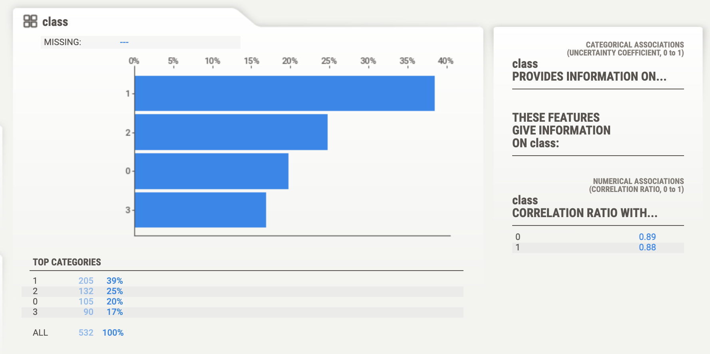

# Exploring a Cryptocurrency Dataset to identify and classify any potential Clusters

## Insight

* I created a report that includes what cryptocurrencies are on the trading market and determine whether they can be grouped to create a classification system for any new investment portfolio.

* I processed the data to fit the machine learning models. Since there is no known classification system, I used unsupervised learning. Through clustering algorithms, I investigated whether the cryptocurrencies can be grouped together with other similar cryptocurrencies. I also created data visualization that can be found throughout the notebook.

### Data Preparation

* This dataset, `crypto_data.csv`, was obtained from [CryptoCompare](https://min-api.cryptocompare.com/data/all/coinlist).

* I first used Sweetviz to do a quick visual on the raw data before any processing.

* I identified and discarded all cryptocurrencies that are not being traded. In other words, I filtered for currencies that are currently being traded. After that I dropped the `IsTrading` column from the dataframe since it has become irrelevant.

* Removed all rows that contained at least one null value.

* Filtered for cryptocurrencies that have been mined. That is, the total coins mined greater than zero.

* Dropped duplicated Coin names.

* In order for the dataset to be comprehensible to a machine learning algorithm, its data should be numeric. Since the coin names do not contribute to the analysis of the data, I dropped the `CoinName` column from the original dataframe but saved it in a different dataframe to reinstate into the final later.

* Next, I converted the remaining features with text values, in this case `Algorithm` and `ProofType`, into numerical data (encoded). To accomplish this task, I used Pandas to create dummy variables. Although this was a necessary stepped, it added alot more features (200+) that will hinder performance. (I solve this issue in the coming steps)

* I also Standardized (scaled) the dataset so that columns that contain larger values do not unduly influence the outcome.

## Dimensionality Reduction

* Creating dummy variables above dramatically increased the number of features in this dataset. I reduced the dimensionality with PCA. 

### PCA

* Rather than specifing the number of principal components when instantiating the PCA model, I stated a desired **explained variance**. For example, say that a dataset has 100 features. Using `PCA(n_components=0.99)` creates a model that will preserve approximately 99% of the explained variance, whether that means reducing the dataset to 80 principal components or 3. For this project, I preserved 90% of the explained variance in dimensionality reduction. The number of features reduced to 94. Tweaking the hyperparameters I was able to reduce features to 66, however, I decided to opt for 4 components based on the outcomes. Basically I ran this test several times but I started at this point everytime. My best numbers came from passing in 4 principal components.

* Next, I further reduced the dataset dimensions with t-SNE and visually inspected the results. I ran t-SNE on the principal components: the output of the PCA transformations. Then I created a scatter plots of the t-SNE outputs. I observed distinct clusters in all sets however the most defined clusters came from passing 4 principal components.

### Cluster Analysis with k-Means

* I created an elbow plot to identify the best number of clusters. Using a for-loop I determine the inertia for each `k` between 2 through 11. Determined where the elbow of the plot was, and at which value of `k` it appears (around 4).

### Recommendation

* Based on my findings, we can classify these Crypto currencies into 4 distinct classes. Basically, after 4 clusters.

